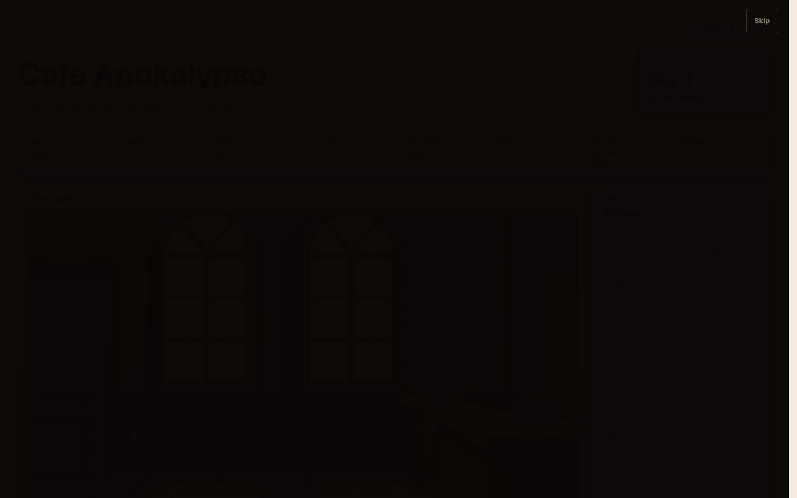
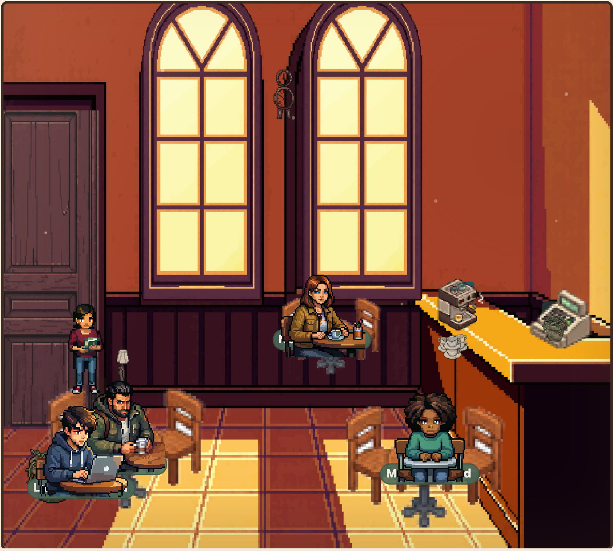
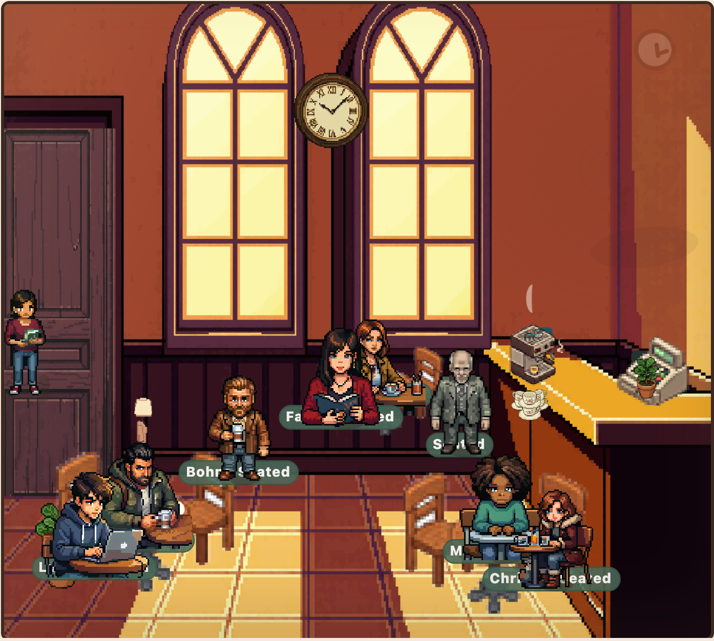
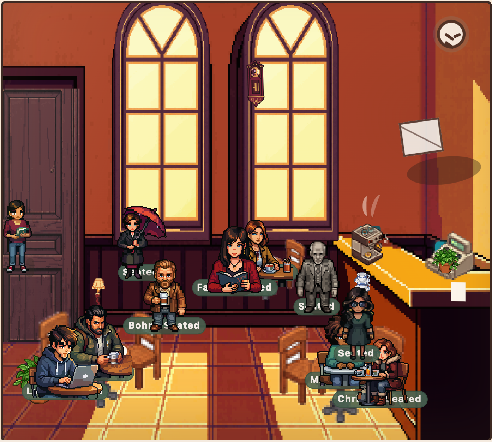

# Screenshots

Aktueller Look des Café-Diorama-Vertical-Slice — als Orientierung für neue
Mitarbeitende, ohne den Dev-Server starten zu müssen.

> Neu erzeugen (nach Änderungen an Szene/Assets): Dev-Server starten
> (`npm run dev`), dann `node tools/screenshot-scenes.mjs`. Einmalige
> Einrichtung: `npm i -D playwright && npx playwright install chromium`
> (Playwright ist bewusst keine Projekt-Dependency).

## Volle Spiel-UI (Tag 1, vor Öffnung)

HUD, Diorama und Action-Panel im Zusammenspiel — der Bildschirm, an dem
gearbeitet wird.

## Diorama über die Woche

Dieselbe Szene in drei Stimmungen (aus dem Lookbook, `lookbook.html`). Zeigt,
wie Sauberkeit, Décor, Gäste und Weirdness mit den Tagen kippen.

| Tag 1 — ruhig & sauber | Tag 4 — voll & belebt | Tag 7 — angespannt & unheimlich |
| --- | --- | --- |
|  |  |  |

Die Positionen aller Elemente sind Daten in
[`src/ui/cafe/scene.ts`](../../src/ui/cafe/scene.ts); Hintergrund und
Detail-Schicht siehe „Diorama-Geometrie" in [`AGENTS.md`](../../AGENTS.md).
